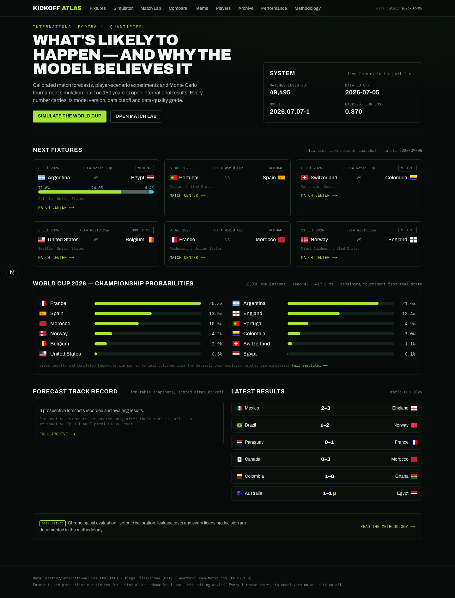

# Mondial XI ⚽

**Probabilistic forecasting and Monte Carlo tournament simulation for
international football** — built end-to-end on public-domain data with
chronological evaluation, honest provenance, and a full product UI.

### ▶ Live demo — **[mondial-xi-web.onrender.com](https://mondial-xi-web.onrender.com)**

*Hosted on a free tier, so the first request after idle can take ~30–60 s to
wake the API — reload once and it's instant. API health:
[`/api/v1/health`](https://mondial-xi-api.onrender.com/api/v1/health).*



> *What is likely to happen, why does the model believe it, how reliable has
> it been — and how would player availability, venue and other assumptions
> change the forecast?*

## What it does

- **Match forecasts** for any pairing of 330+ national teams: win/draw/loss
  probabilities, expected goals, a Dixon–Coles scoreline matrix, clean-sheet /
  BTTS / over-under analytics, extra-time & shootout math — each stamped with
  model version, data cutoff and a data-quality grade.
- **Match Lab**: mark players unavailable or doubtful (marginalized over
  availability probability), toggle venue/importance, and watch the forecast
  respond — every change is a labeled *user assumption*, shareable by URL.
- **Scenario Compare**: two scenarios side-by-side with percentage-point deltas.
- **World Cup 2026 simulator**: the *real, in-progress* tournament
  reconstructed from data — completed group stage and knockouts are pinned,
  remaining rounds simulated 10,000× in ~0.4 s with the verified 2026 rules
  (head-to-head-first tiebreakers, best-thirds, round of 32). Lock upsets,
  set seeds, or replay the whole tournament as a what-if.
- **World Cup 2030 Outlook**: qualification → final draw → tournament
  simulated end-to-end from today's ratings, with every unannounced FIFA
  detail listed as an explicit assumption (verified: all six 2030 hosts
  auto-qualify).
- **Team & player explorers**: Elo history since 1872, venue splits, form,
  goalscorer-derived player profiles labeled as *recorded* (partial-coverage)
  counts with per-player coverage figures and share-based scenario weights.
- **Auditable track record**: prospective forecasts stored as immutable
  content-hashed snapshots before kickoff, scored after; backtests are always
  labeled separately.

## Measured results

<!-- METRICS:START (generated by scripts/update_readme_metrics.py — do not edit) -->
**Data:** 49,503 completed internationals (1872-11-30 → 2026-07-11),
2 upcoming fixtures, 47,898 goal events · model `2026.07.13-1`

**Protocol:** fit 1980-01-01 → 2018-12-31
(30,133 matches) · validation 2019-01-01 → 2022-12-31
(3,581) · untouched test 2023-01-01 → 2026-07-11
(3,697) · champion selected fully out-of-sample on validation · Elo tuned to
home_advantage=80, k_scale=0.75

| Model | Val log loss | Test log loss | Test RPS | Test acc. | Test ECE |
|---|---|---|---|---|---|
| frequency_baseline | 1.0459 | 1.0542 | 0.2294 | 47.3% | 0.0113 |
| elo_logistic | 0.8607 | 0.8666 | 0.1689 | 60.3% | 0.0195 |
| poisson | 0.8614 | 0.8673 | 0.1693 | 60.5% | 0.0196 |
| dixon_coles | 0.8606 | 0.8659 | 0.1691 | 60.5% | 0.0158 |
| gbm_uncalibrated | 0.8712 | 0.8729 | 0.1691 | 60.5% | 0.0252 |
| gbm_calibrated | 0.8885 | 0.8698 | 0.1686 | 60.8% | 0.0130 |
| geometric_ensemble ⭐ | 0.8585 | 0.8642 | 0.1685 | 60.2% | 0.0171 |

**Champion (`geometric_ensemble`) on untouched test (n=3,697):** log loss
**0.8642**, RPS **0.1685**, Brier 0.5082, top-pick
accuracy **60.2%**, ECE **0.0171** — best on both validation and test.
Honest note: a *learned* stack and the isotonic-calibrated GBM overfit this modest data and
lose under rigorous out-of-sample selection; the parameter-free geometric mean generalizes.
<!-- METRICS:END -->

## Architecture

```
                 ┌────────────────────────────────────────────────┐
                 │  data/raw (immutable CC0 CSVs + SHA-256 manifests) │
                 └───────────────┬────────────────────────────────┘
                                 ▼  ingestion / validation (polars)
   ┌──────────────┐   ┌──────────────────────┐   ┌────────────────────┐
   │ entities      │→ │ chronological feature │→ │ models: Elo·Poisson │
   │ teams/players │   │ builder (leak-proof)  │   │ Dixon–Coles·GBM+iso │
   └──────────────┘   └──────────────────────┘   └─────────┬──────────┘
                                                            ▼ artifacts
   ┌────────────────────────────────────────────────────────────────────┐
   │ ml/artifacts: prediction_bundle.joblib · metrics.json · calibration │
   └───────────────┬────────────────────────────────────────────────────┘
                   ▼ read-only load (never trains at startup)
   ┌──────────────────────────┐  REST /api/v1  ┌──────────────────────┐
   │ FastAPI · SQLite snapshots│ ◄────────────► │ Next.js 16 · React 19 │
   │ providers · MC simulator  │                │ Tailwind v4 · Recharts │
   └──────────────────────────┘                └──────────────────────┘
```

Monorepo: `ml/` (Python package: ingestion → features → models → evaluation →
simulation) · `apps/api` (FastAPI) · `apps/web` (Next.js App Router) ·
`packages/shared|ui` (TS) · `data/` (manifests, fixtures, tournament configs) ·
`tests/` (unit / integration / e2e).

## Data sources & licensing

| Source | Use | License |
|---|---|---|
| [martj42/international_results](https://github.com/martj42/international_results) | results, goalscorers, shootouts, former names | **CC0 1.0** |
| Self-computed Elo | ratings | derivative of CC0 data |
| [flag-icons](https://github.com/lipis/flag-icons) | country flags | MIT |
| [Open-Meteo](https://open-meteo.com/) | match-day weather (display only) | CC BY 4.0, non-commercial free tier |
| [football-data.org](https://www.football-data.org/) *(optional)* | live fixture enrichment | free tier w/ attribution |

Rejected sources (API-Football publication rights, eloratings.net scraping,
TheSportsDB imagery, …) and the full capability matrix:
[docs/data-source-evaluation.md](docs/data-source-evaluation.md).
No federation crests, tournament logos or player photos are used.

## Quick start

```bash
# prerequisites: uv (astral.sh/uv), pnpm, Node 20+
make bootstrap    # install Python + JS deps
make data         # download CC0 data, validate, build parquet + player registry
make train        # tune Elo, fit & evaluate models, write artifacts (~2 min)
make dev          # API :8000 + web :3000
```

No credentials required for anything above. Optional: set
`FOOTBALL_DATA_API_KEY` (free registration) for live fixture enrichment —
see [.env.example](.env.example) and [docs/provider-setup.md](docs/provider-setup.md).

### Commands

`make test` (pytest + Vitest) · `make test-e2e` (Playwright) · `make lint` ·
`make typecheck` (mypy + tsc) · `make build` · `make check` (all gates) ·
`make screenshots` · `make data-status` (provenance report).

### API example

```bash
curl -s localhost:8000/api/v1/predictions/match \
  -H 'Content-Type: application/json' \
  -d '{"home_id":"norway","away_id":"england","neutral":true,
       "scenario":{"home_absences":["norway/erling-haaland"]}}' | jq .probabilities
```

Interactive docs at `localhost:8000/api/docs`.

## Testing

- **Temporal-integrity suite**: proves future results, the match's own result,
  and dataset truncation cannot alter pre-match features.
- Elo properties, Dixon–Coles behavior, metric correctness, probability
  normalization, 2026 tiebreaker cases (incl. H2H-before-GD), thirds
  allocation, locked results, deterministic seeds.
- 20 API integration tests over the real artifacts (honest degradation
  without credentials included).
- Vitest component tests; Playwright journeys (fixtures → match center →
  scenario → simulator lock → archive; keyboard nav; mobile nav; console-error
  checks).

## Deployment

**One-click on Render:** connect this repo as a Blueprint and
[`render.yaml`](render.yaml) provisions the full app (web + API) on the free
plan. The API image builds the CC0 data and trains the models during its
Docker build, so it deploys self-contained — the live site behaves exactly
like `make dev`. Step-by-step + other hosts (Railway, Fly, Vercel+Render):
[docs/deployment.md](docs/deployment.md).

Dockerfiles in [infrastructure/](infrastructure), local stack via
`docker compose up --build`, CI (lint, types, tests, builds, container smoke
test, e2e) in `.github/workflows/ci.yml`, and a daily data-refresh workflow
that retrains and can trigger a redeploy.

## Limitations (read before quoting numbers)

- Team-level model; no licensed lineup/injury feed exists on a free tier, so
  the player-aware layer is a clearly-labeled scenario tool (attack-side,
  scoring-derived, shrunken), **not** part of the evaluated champion.
- Goal-detail coverage is ~34% of scoring matches (majors are well covered).
- Shootouts are 50/50; conduct/FIFA-ranking tiebreakers are proxied by Elo
  (both documented approximations).
- Fixtures come from the dataset snapshot with an explicit retrieval
  timestamp — not a live feed unless the optional provider is configured.

## Documentation

[architecture](docs/architecture.md) · [methodology](docs/methodology.md) ·
[model card](docs/model-card.md) · [data card](docs/data-card.md) ·
[player model](docs/player-model.md) · [availability](docs/availability-model.md) ·
[tournament rules](docs/tournament-rules.md) · [providers](docs/provider-setup.md) ·
[deployment](docs/deployment.md) · [security](docs/security.md) ·
[case study](docs/portfolio-case-study.md) · [interview guide](docs/interview-guide.md) ·
[decisions](DECISIONS.md) · [risk register](RISK_REGISTER.md)

## License

Source code under the [MIT License](LICENSE). Data and assets keep their
upstream licenses (all CC0 / MIT / CC BY 4.0 — see
[data-source-evaluation](docs/data-source-evaluation.md)). Forecasts are
probabilistic estimates for educational use, not betting advice.
